# 🌱 LactareConnect

App mobile que conecta **pessoas doadoras de leite humano** a bancos de leite, do cadastro ao agendamento da coleta, com uma assistente virtual com IA generativa integrada.

Desenvolvido como desafio em parceria com **Eurofarma/Lactare**.

---

## 📱 Sobre o projeto

O app resolve a fricção do processo de doação de leite humano em um fluxo único: localizar um banco de leite próximo, cumprir os exames pré-doação exigidos, agendar a coleta e acompanhar o próprio histórico — com uma assistente virtual disponível para tirar dúvidas a qualquer momento.

## ✨ Funcionalidades

| Aba | O que faz |
|---|---|
| **Início / FAQ** | Perguntas frequentes categorizadas, com busca e feedback de utilidade |
| **Doar** | Mapa de bancos de leite (OpenStreetMap), geolocalização, upload de exames, agendamento da coleta |
| **Chat (Lila)** | Assistente virtual com IA generativa (Google Gemini), com contexto da FAQ real do app |
| **Recompensas** | Catálogo de recompensas resgatáveis com o saldo de Gotinhas acumulado a cada doação |
| **Conta** | Perfil, edição de dados/endereço, preferências de notificação e logout |

Todo o fluxo — cadastro, login, agendamento, upload de exame, resgate de recompensa, conversa com a Lila — é validado ponta a ponta contra o backend real, não apenas mockado.

## 📲 Telas do sistema

O fluxo abaixo segue a ordem real de navegação: da boas-vindas até o dia a dia da pessoa doadora já logada, passando pelas 5 abas fixas da home (`Início` · `Doar` · `Chat` · `Recompensas` · `Conta`, ver `HomeShell` em `lib/core/router/home_shell.dart`). Prints tirados no emulador Android, com o app consumindo o backend real em produção.

### Autenticação (fora da home, sem sessão)

| Boas-vindas | Login | Cadastro — 1/3 Identidade |
|---|---|---|
| 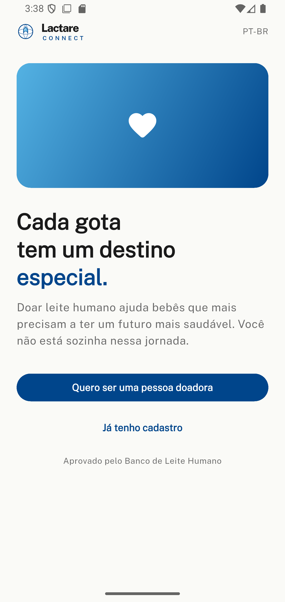 | 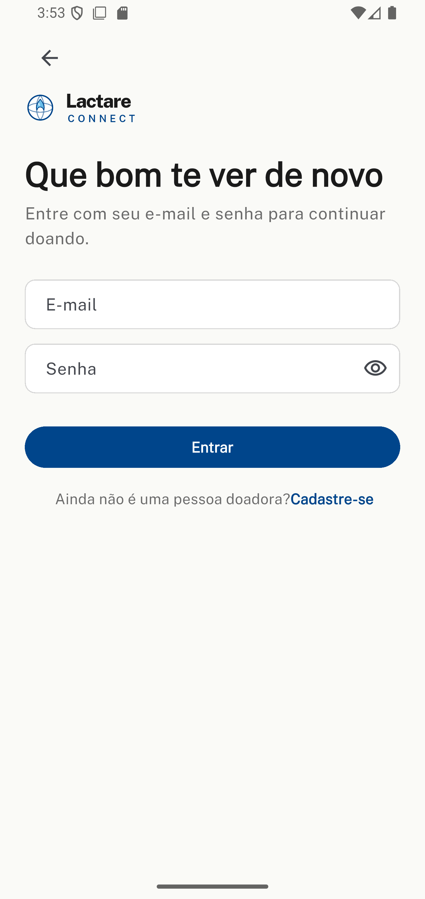 | 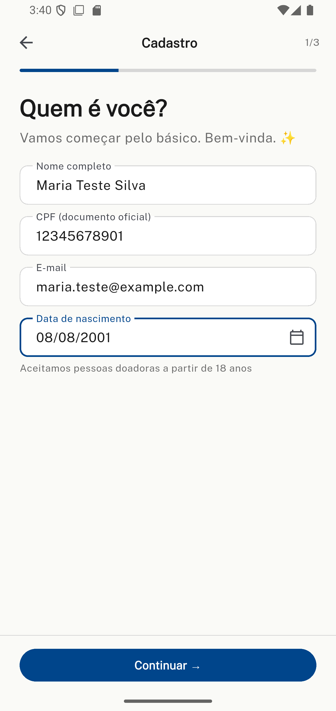 |

| Cadastro — 2/3 Contato e endereço | Cadastro — 3/3 Senha |
|---|---|
| 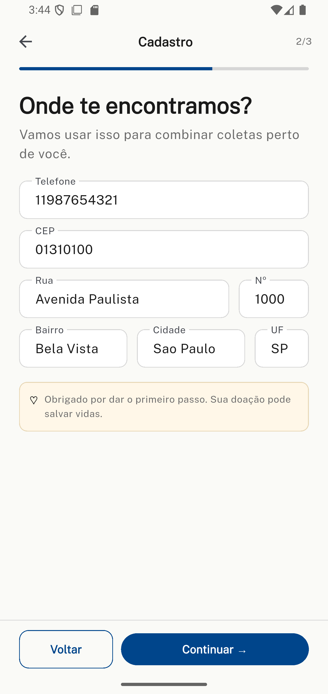 | 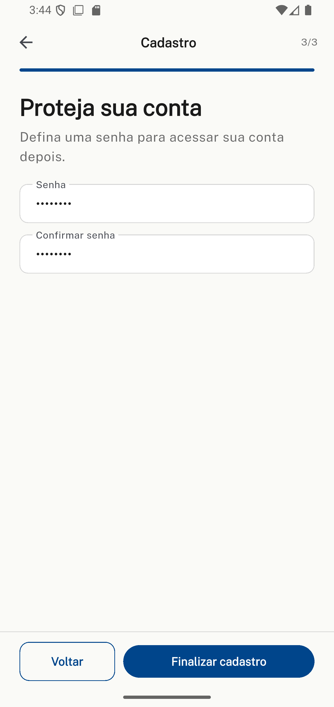 |

A tela de **boas-vindas** (`welcome_screen.dart`) é a raiz de quem ainda não tem sessão: leva pro **login** (`login_screen.dart`) ou pro **cadastro** (`cadastro_screen.dart`), um wizard de 3 passos — identidade, contato/endereço e senha — com validação em cada campo antes de avançar. Ao concluir qualquer um dos dois fluxos com sucesso, o `go_router` redireciona automaticamente pra home (ver guard de sessão em `lib/core/router/app_router.dart`); tentar voltar pra essas telas já autenticada faz o mesmo redirect no sentido contrário.

### Home — 5 abas fixas (com sessão)

| Início · FAQ | Doar · mapa e bancos | Doar · agendar coleta |
|---|---|---|
| 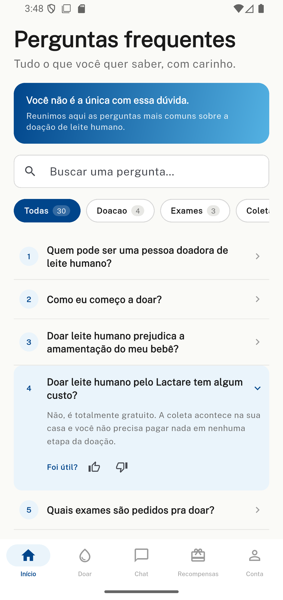 | 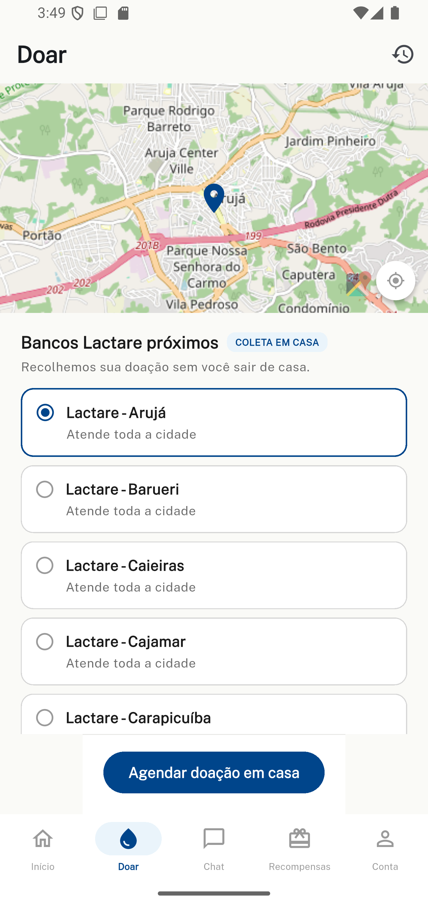 | 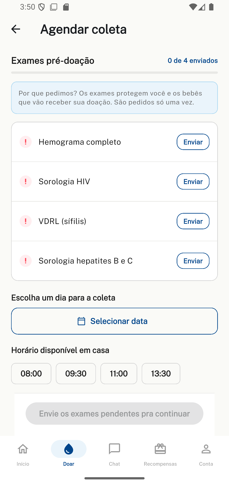 |

| Chat · Lila | Recompensas | Conta |
|---|---|---|
| 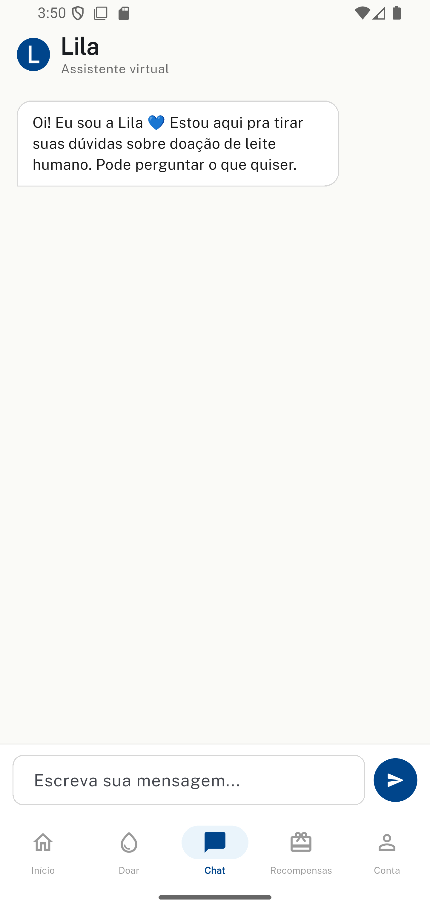 | 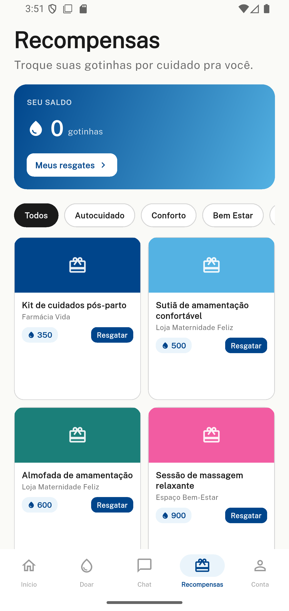 | 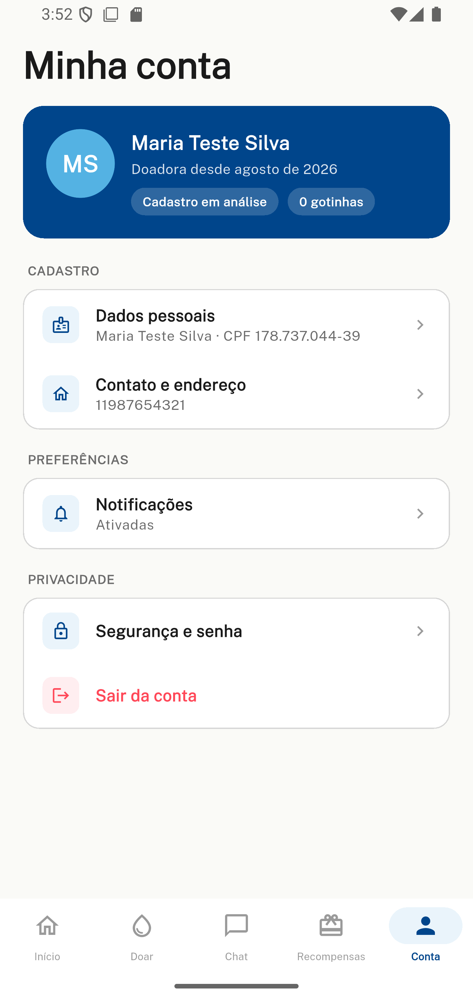 |

- **Início** é a primeira aba (FAQ categorizada, com busca e feedback de utilidade por pergunta).
- **Doar** mostra o mapa real (OpenStreetMap) com os bancos Lactare próximos à doadora; ao escolher um banco, "Agendar doação em casa" abre a tela de agendamento, onde é preciso enviar os 4 exames pré-doação antes de liberar a escolha de data/horário — o botão de confirmar fica desabilitado com uma mensagem explícita até isso acontecer. Essa tela tem uma sub-rota própria, "Meus agendamentos", pro histórico.
- **Chat** abre a conversa com a Lila, a assistente virtual (Gemini) com contexto da FAQ real do app.
- **Recompensas** lista o catálogo trocável pelo saldo de Gotinhas, com sub-rotas para o detalhe de cada recompensa e para "Meus resgates".
- **Conta** reúne dados pessoais, contato/endereço, preferências de notificação e o logout; a sub-rota "Configurações" fica dentro dela.

Cada aba mantém sua própria pilha de navegação (`StatefulNavigationShell` do `go_router`) — sair de um sub-fluxo dentro de "Doar" e voltar depois de visitar "Chat" retoma exatamente de onde a doadora parou.

## 🏗️ Arquitetura e stack

**App (este repositório)**
- **Flutter** (Dart) — Android, iOS e Web
- **Riverpod** para gerenciamento de estado (`AsyncNotifier`/`FutureProvider`)
- **go_router** para navegação declarativa, com guard de sessão/RBAC
- **Dio** como cliente HTTP, com interceptors para token Bearer e tratamento de erros
- **flutter_secure_storage** para persistência segura do JWT
- **flutter_map + geolocator** para mapa real e geolocalização na tela de doação
- **image_picker + file_picker** para upload de exames
- Organização **feature-first** inspirada em Clean Architecture, com camadas `domain` / `data` / `presentation` por feature — escolhida por termos várias funcionalidades bem distintas (auth, FAQ, doação, chat, recompensas, conta), cada uma agrupando seu próprio código de tela, regra de negócio e acesso a dados, em vez de espalhar por pastas genéricas (`widgets/`, `services/`, `providers/`) misturando funcionalidades diferentes

**Backend** ([`LactareConnect-backend`](https://github.com/Fiszbejn/LactareConnect-backend))
- **NestJS** (TypeScript) com **TypeORM** sobre **Oracle Database**
- Autenticação **JWT** + autorização **RBAC** (papéis `nutriz`/`administrador`, incluindo regra "dono do próprio registro")
- API REST documentada via **Swagger**, containerizada com **Docker Compose**
- Assistente virtual **Lila** integrada ao **Google Gemini** (`@google/genai`), com prompt de sistema construído dinamicamente a partir da FAQ cadastrada

```
lib/
├── core/                 # Infra compartilhada: tema, rede (Dio), sessão, rotas, widgets
│   ├── error/
│   ├── network/
│   ├── router/
│   ├── session/
│   ├── theme/
│   └── widgets/
└── features/             # Uma pasta por funcionalidade, mesma estrutura interna
    ├── auth/
    ├── faq/
    ├── doacao/
    ├── chat/
    ├── recompensas/
    └── conta/
        ├── data/         # Repositórios, DTOs, chamadas HTTP
        ├── domain/       # Entidades e regras de negócio
        └── presentation/ # Telas, controllers/providers Riverpod
```

## 🚀 Como rodar

### Pré-requisitos
- [Flutter SDK](https://docs.flutter.dev/get-started/install) (^3.11.3)
- Um emulador Android/iOS, Chrome, ou dispositivo físico

### Configuração da API

O app já aponta por padrão para o backend em produção, hospedado no Render:
`https://lactareconnect-backend.onrender.com/v1` (`lib/core/network/api_constants.dart`).

A URL é fixa no código de propósito — o backend já está deployado, então quem for
rodar/avaliar o app não precisa subir o backend localmente via Docker/Oracle para
testar o fluxo completo. Para apontar para um backend local (ex: durante
desenvolvimento do próprio backend), basta trocar `ApiConstants.baseUrl` em
`lib/core/network/api_constants.dart` pela URL local (`http://localhost:3000/v1`,
ou `http://10.0.2.2:3000/v1` no caso de emulador Android).

O código-fonte do backend está em [`LactareConnect-backend`](https://github.com/Fiszbejn/LactareConnect-backend),
com instruções de deploy local via `docker compose` no próprio README dele.

### Rodar o app
```bash
flutter pub get
flutter run                # escolhe o dispositivo disponível
# ou, por exemplo:
flutter run -d chrome
flutter run -d emulator-5554
```

## 🧠 Destaques técnicos

- **Integração com IA generativa**: a Lila usa o histórico real da conversa + a base de FAQ do produto como contexto para o Gemini, com fallback gracioso caso a API externa falhe (o endpoint nunca quebra).
- **RBAC granular por método HTTP**: o backend libera `POST` para a nutriz apenas nos próprios registros e mantém `GET` (histórico de conversas) restrito a administradores — regra de privacidade garantida estruturalmente na API, não só na camada visual do app.
- **Escopo sempre validado contra o contrato real da API**: funcionalidades sem respaldo real no backend (ex: regras de pontuação fictícias, campos inexistentes) foram conscientemente cortadas ou ajustadas, em vez de mockadas.
- **Tratamento de casos de borda reais**: geolocalização sem sinal de GPS, contas sem endereço cadastrado, timestamps em UTC vindos do backend, navegação aninhada com `go_router` — todos identificados testando o app de ponta a ponta, não só por análise estática.

## 🛠️ Skills demonstradas

- Arquitetura de app mobile em camadas (feature-first / Clean Architecture) com Flutter e Riverpod
- Design e consumo de API REST com autenticação JWT e autorização baseada em papéis (RBAC)
- Integração com serviços externos: geolocalização, seleção de arquivos, mapas (OpenStreetMap) e IA generativa (Google Gemini)
- Modelagem de backend com NestJS, TypeORM e banco relacional Oracle
- Containerização com Docker e Docker Compose
- Depuração e correção de bugs reais de integração cliente-servidor (não só erros de compilação)

---

<br/>
<br/>

<p align="center">
  
  &emsp;&emsp;×&emsp;&emsp;
  
</p>
